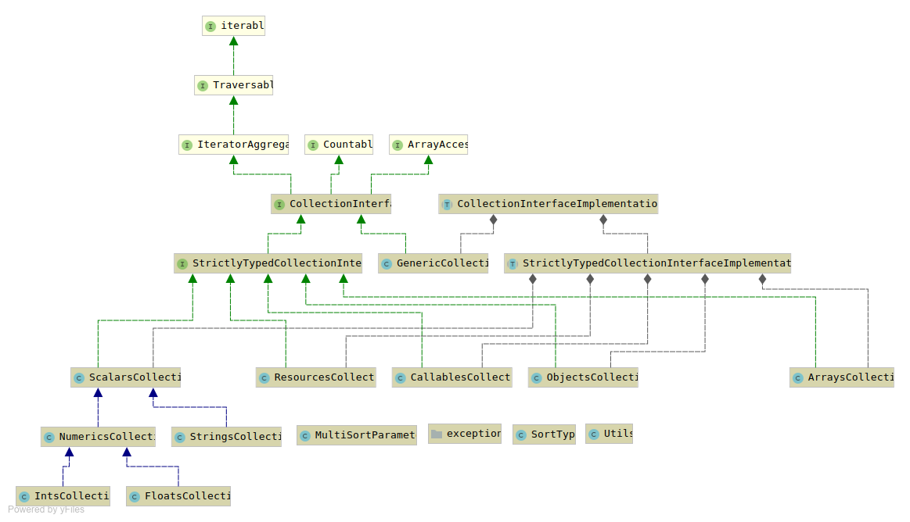

# Versatile Collections
[](https://github.com/rotexsoft/versatile-collections/actions) &nbsp;
[](https://github.com/rotexsoft/versatile-collections/releases/latest) &nbsp;
[](https://github.com/rotexsoft/versatile-collections/blob/master/LICENSE) &nbsp;
[](https://coveralls.io/github/rotexsoft/versatile-collections?branch=master) &nbsp;
 &nbsp;
 &nbsp;
 &nbsp;
 &nbsp;
 &nbsp;
 &nbsp;
 &nbsp;
<a href="https://libraries.io/github/rotexsoft/versatile-collections">

</a>

A collection package that can be extended to implement things such as a Dependency Injection Container,
RecordSet objects for housing database records, a bag of http cookies, or technically any collection of
items that can be looped over and whose items can each be accessed using array-access syntax or object
property syntax.

You can:
* use one of the provided Collection classes directly in your application(s)
* or include one or more of the provided Collection classes within an existing class in your application and expose features you want (Composition)
* or extend one or more of the the provided Collection classes (Inheritance) and then use those extended classes in your application(s)
* or just implement one or more of the Collection Interfaces and use the corresponding trait (Contract fulfillment)

This package provides optional strict-typing of collection items and strives for 100 % unit-test coverage.



## Installation 

**Via composer:** (Requires PHP 7.4+ or PHP 8.0+). 

Switch to the 3.X branch to read the documentation for the 3.X version.

Switch to the 4.X branch to read the documentation for the 4.X version.

Switch to the 5.2.x branch to read the documentation for the 5.2.X+ version.


    composer require rotexsoft/versatile-collections


## Basics 

If you are simply looking to store items of the same or differing types in a collection you can use simply use the **GenericCollection** class like so:

```php
<?php
use \VersatileCollections\GenericCollection;

// items to be stored in your collection
$item1 = ['yabadoo'];                        // an array
$item2 = function(){ echo 'Hello World!'; }; // a callable
$item3 = 777.888;                            // a float
$item4 = 777;                                // an int
$item5 = new \stdClass();                    // an object
$item6 = new \ArrayObject([]);               // another object
$item7 = tmpfile();                          // a resource
$item8 = true;                               // a boolean
$item9 = "true";                             // a string

// Technique 1: pass the items to the constructor of the collection class
$collection = new \VersatileCollections\GenericCollection(
    $item1, $item2, $item3, $item4, $item5, $item6, $item7, $item8, $item9
);

// Technique 2: pass the items in an array using argument unpacking
//              to the constructor of the collection class
$collection = new GenericCollection(
    ...[$item1, $item2, $item3, $item4, $item5, $item6, $item7, $item8, $item9]
);

// Technique 3: pass the items in an iterable (such as an array) to the static makeNew helper method
//              available in all collection classes
$collection = GenericCollection::makeNew(
    [$item1, $item2, $item3, $item4, $item5, $item6, $item7, $item8, $item9]
);

// Technique 4: create an empty collection object and subsequently add each
//              item to the collection via array assignment syntax or object
//              property assignment syntax or using the appendItem($item), 
//              prependItem($item, $key=null), push($item) or put($key, $value)
//              methods
$collection = new GenericCollection(); // empty collection
// OR
$collection = GenericCollection::makeNew(); // empty collection

$collection[] = $item1; // array assignment syntax without key
                        // the item is automatically assigned
                        // the next available integer key. In
                        // this case 0

$collection[] = $item2; // array assignment syntax without key
                        // the next available integer key in this
                        // case is 1

$collection['some_key'] = $item3; // array assignment syntax with specified key `some_key`

$collection->some_key = $item4; // object property assignment syntax with specified property
                                // `some_key`. This will update $collection['some_key']
                                // changing its value from $item3 to $item4

$collection->appendItem($item3)  // same effect as:
           ->appendItem($item5); //     $collection[] = $item3;
                                 //     $collection[] = $item5;
                                 // Adds an item to the end of the collection    
                                 // You can chain the method calls

$collection->prependItem($item6, 'new_key'); // adds an item with the optional
                                             // specified key to the front of
                                             // collection.
                                             // You can chain the method calls

$collection->push($item7);  // same effect as:
                            //     $collection[] = $item7;
                            // Adds an item to the end of the collection    
                            // You can chain the method calls

$collection->put('eight_item', $item8)  // same effect as:
           ->put('ninth_item', $item9); //     $collection['eight_item'] = $item8;
                                        //     $collection['ninth_item'] = $item9;
                                        // Adds an item with the specified key to 
                                        // the collection. If the specified key
                                        // already exists in the collection the
                                        // item previously associated with the 
                                        // key is overwritten with the new item.    
                                        // You can chain the method calls

```

You can also make any class in your application behave exactly like **\VersatileCollections\GenericCollection** 
by implementing **\VersatileCollections\CollectionInterface** and using 
**\VersatileCollections\CollectionInterfaceImplementationTrait** in such classes.

If you want to enforce strict-typing, the following Collection classes are provided
in this package:

* **[Arrays Collections](docs/ArraysCollection.md):** a collection that only stores items that are arrays (i.e. items for which is_array is true)
* **[Callables Collections](docs/CallablesCollections.md):** a collection that only stores items that are callables (i.e. items for which is_callable is true)
* **[Objects Collections](docs/ObjectsCollections.md):** a collection that only stores items that are objects (i.e. items for which is_object is true)
    * **[Non-Array Iterables Collections](docs/NonArrayIterablesCollection.md):** a collection that only accepts items that are objects for which [\is_iterable](https://www.php.net/manual/en/function.is-iterable) returns true. This type of collection does not accept [arrays](https://www.php.net/manual/en/language.types.array.php) which are also iterables but not objects. Use [Arrays Collections](docs/ArraysCollection.md) to store arrays or you could create a new collection class that accepts all iterables (both arrays & every other type for which **is_iterable** returns **true**)
    * **[Specific Objects Collections](docs/SpecificObjectsCollection.md):** a collection that only stores items that are instances of a specified class or any of its sub-classes
* **[Resources Collections](docs/ResourcesCollections.md):** a collection that only stores items that are resources (i.e. items for which is_resource is true)
* **[Scalars Collections](docs/ScalarsCollections.md):** a collection that only stores items that are scalars (i.e. items for which is_scalar is true)
    * **[Numerics Collections](docs/NumericsCollections.md):** a collection that only stores items that are either floats or integers (i.e. items for which is_int or is_float is true)
        * **[Floats Collections](docs/FloatsCollections.md):** a collection that only stores items that are floats (i.e. items for which is_float is true)
        * **[Ints Collections](docs/IntsCollections.md):** a collection that only stores items that are integers (i.e. items for which is_int is true)
    * **[Strings Collections](docs/StringsCollections.md):** a collection that only stores items that are strings (i.e. items for which is_string is true)

To implement a custom collection that only contains objects that are instances of
a specific class (for example **\PDO**), your custom collection class must adhere to
the following requirements:

* Your custom collection class must implement **\VersatileCollections\StrictlyTypedCollectionInterface** which currently contains the methods below:

    * **public function checkType($item): bool** : it must return true if `$item` is of the expected type or false otherwise
    * **public function getTypes()** : it must return an instance of **\VersatileCollections\StringsCollection** of strings representing the name(s) of the expected type(s)

* Your custom collection class should use **\VersatileCollections\StrictlyTypedCollectionInterfaceImplementationTrait** (which contains implementation of the methods in **\VersatileCollections\StrictlyTypedCollectionInterface**). If you choose not to use **\VersatileCollections\StrictlyTypedCollectionInterfaceImplementationTrait**, then you will have to implement all the methods specified in **\VersatileCollections\StrictlyTypedCollectionInterface** and make sure you call the **checkType($item)** method in every method where you add items to or modify items in the collection such as **offsetSet($key, $val)**  and throw an **VersatileCollections\Exceptions\InvalidItemException** exception whenever **checkType($item)** returns false. If you use **\VersatileCollections\StrictlyTypedCollectionInterfaceImplementationTrait** in your custom collection class but add new methods that also add items to or modify items in the collection you can use the helper method **isRightTypeOrThrowInvalidTypeException($item, $calling_functions_name)** provided in **\VersatileCollections\StrictlyTypedCollectionInterfaceImplementationTrait** to validate items (it will automatically throw an exception for you if the item you are validating is of the wrong type; see **\VersatileCollections\StrictlyTypedCollectionInterfaceImplementationTrait::offsetSet($key, $val)** for an example of how this helper method should be used).

* You can optionally override **StrictlyTypedCollectionInterfaceImplementationTrait::__construct(...$arr_objs)** with a constructor
with the same signature but with the specific type. For example, **__construct(\PDO ...$pdo_objs)** ensures that only instances of
**\PDO** can be injected into the constructor via argument unpacking. 

The code example below shows how a custom collection class called **PdoCollection**, 
that only stores items that are instances of **\PDO**, can be implemented:

```php
<?php 
use \VersatileCollections\StrictlyTypedCollectionInterface;

class PdoCollection implements StrictlyTypedCollectionInterface { //1. Implement interface
    
    use \VersatileCollections\StrictlyTypedCollectionInterfaceImplementationTrait; //2. Use trait
    
    public function __construct(\PDO ...$pdo_objs) { //3. Optionally override the constructor with a type
                                                     //   specific one
        $this->versatile_collections_items = $pdo_objs;
    }

    /**
     * 
     * @return bool true if $item is of the expected type, else false
     * 
     */
    public function checkType($item): bool { //4. implement interface methods not implemented in trait above
        
        return ($item instanceof \PDO);
    }
    
    /**
     * 
     * @return string|array a string or array of strings of type name(s) 
     *                      for items acceptable in instances of this 
     *                      collection class
     * 
     */
    public function getTypes(): \VersatileCollections\StringsCollection { //4. implement interface methods not implemented in trait above
        
        return new \VersatileCollections\StringsCollection(\PDO::class);
    }
}
```

You can declare your custom typed collection classes as **final** so that users of your 
classes will not be able to extend them and thereby circumvent the type-checking 
being enforced at construct time and item addition time.

> **NOTE:** If you only want to store items that are only instances of a specific class 
or its sub-classes in a collection and don't want to have to create a custom collection 
>class for that purpose, simply use [SpecificObjectsCollection](docs/SpecificObjectsCollection.md)

## Documentation

* [Methods Glossary by Category](docs/MethodsByCategory.md)
* [Methods Descriptions with Examples](docs/MethodDescriptions.md)
* [Generic Collections](docs/GenericCollections.md)
* Strictly Typed Collections
    * [Arrays Collections](docs/ArraysCollection.md): a collection that can only contain [arrays](http://php.net/manual/en/language.types.array.php)
    * [Callables Collections](docs/CallablesCollections.md): a collection that can only contain [callables](http://php.net/manual/en/language.types.callable.php)
    * [Objects Collections](docs/ObjectsCollections.md): a collection that can only contain [objects](http://php.net/manual/en/language.types.object.php) (any kind of object)
        * [Non-Array Iterables Collections](docs/NonArrayIterablesCollection.md): a collection that can only contain items that are objects (but not [arrays](https://www.php.net/manual/en/language.types.array.php)) for which [\is_iterable](https://www.php.net/manual/en/function.is-iterable) returns true
        * [Specific Objects Collections](docs/SpecificObjectsCollection.md): a collection that can either contain only instances of a specified class or any of its sub-classes or any type of [object](http://php.net/manual/en/language.types.object.php) (just like [Objects Collections](docs/ObjectsCollections.md)) if no class is specified
    * [Resources Collections](docs/ResourcesCollections.md): a collection that can only contain [resources](http://php.net/manual/en/language.types.resource.php)
    * [Scalars Collections](docs/ScalarsCollections.md): a collection that can only scalar values. I.e. any of [booleans](http://php.net/manual/en/language.types.boolean.php), [floats](http://php.net/manual/en/language.types.float.php), [integers](http://php.net/manual/en/language.types.integer.php) or [strings](http://php.net/manual/en/language.types.string.php). It accepts any mix of scalars, e.g. ints, booleans, floats and strings can all be present in an instance of this type of collection.
        * [Numerics Collections](docs/NumericsCollections.md): a collection that can only contain [floats](http://php.net/manual/en/language.types.float.php) and/or [integers](http://php.net/manual/en/language.types.integer.php)
            * [Floats Collections](docs/FloatsCollections.md): a collection that can only contain [floats](http://php.net/manual/en/language.types.float.php)
            * [Ints Collections](docs/IntsCollections.md): a collection that can only contain [integers](http://php.net/manual/en/language.types.integer.php)
        * [Strings Collections](docs/StringsCollections.md): a collection that can only contain [strings](http://php.net/manual/en/language.types.string.php)
* [Laravel Collection Methods Equivalence](docs/LaravelMethodsEquivalence.md)

* Please submit an issue or a pull request if you find any issues with the documentation.

## Issues

* Please submit an issue or a pull request if you find any bugs or better 
and more efficient way(s) things could be implemented in this package.

## Contributing

As of May 16 2023, version 5.2.0 is the latest stable version with a minimum PHP 7.4 requirement.
Only bugfixes will be accepted for this version and they should be applied to the 5.2.x branch.
- Bugfixes for version 4.x should be applied to the 4.X branch.
- Bugfixes for version 3.x should be applied to the 3.X branch.
- Bugfixes for version 2.x should be applied to the 2.X branch.

The master branch currently contains code that is in preparation for the next major version 6 
scheduled to be released at the end of 2023 which will have PHP 8.1 as a minimum requirement.
