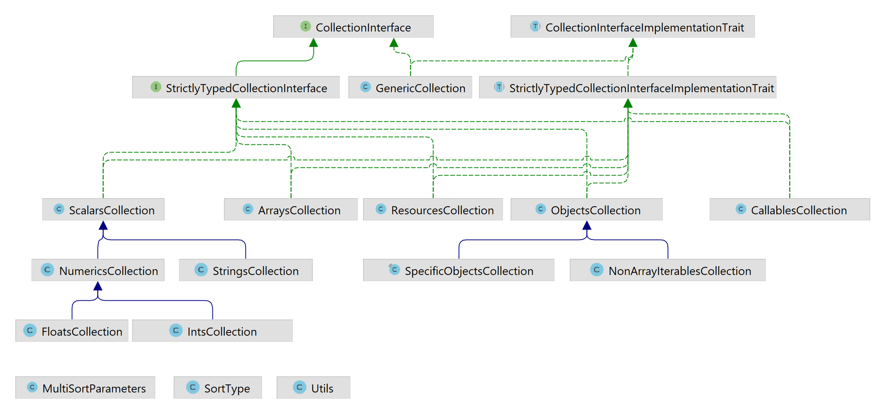

# Versatile Collections
[](https://travis-ci.org/rotexsoft/versatile-collections) &nbsp; 
[](https://www.codacy.com/app/rotexdegba/versatile-collections?utm_source=github.com&amp;utm_medium=referral&amp;utm_content=rotexsoft/versatile-collections&amp;utm_campaign=Badge_Grade) &nbsp; 
[](https://github.com/rotexsoft/versatile-collections/releases/latest) &nbsp; 
[](https://github.com/rotexsoft/versatile-collections/blob/master/LICENSE) &nbsp; 

A collection package that can be extended to implement things such as a Dependency Injection Container,
RecordSet objects for housing database records, a bag of http cookies, or technically any collection of
items that can be looped over and whose items can each be accessed using array-access syntax or object
property syntax.

This package provides optional strict-typing of collection items and strives for 100 % unit-test coverage.



## Installation 

**Via composer:** (Requires PHP 5.6+)


    composer require rotexsoft/versatile-collections


## Usage 

Use or extend the `GenericCollection` class to create collections that can contain items of differing types.

Extend the `StrictlyTypedCollection` class or directly use any of its sub-classes to create collections 
that will only contain items of the same type (e.g. objects, ints, floats, strings, callables, resources etc).

To create a custom strictly typed collection of objects belonging to a specific class, follow the pattern below 
(we are creating a collection of PDO objects below):

```php
<?php 

class PdoCollection extends \VersatileCollections\StrictlyTypedCollection {

    // Completely override __construct of
    // \VersatileCollections\StrictlyTypedCollection.
    //
    // The type-hint in the constructor's signature
    // will guarantee that only instances of \PDO
    // will be successfully injected into this class
    // at construct time
    public function __construct(\PDO ...$arr_objs) {
                
        $this->collection_items = $arr_objs;
    }

    // $this->checkType($item) will be used in 
    // \VersatileCollections\StrictlyTypedCollection::offsetSet($key, $val)
    // when items are added to this collection via
    // the $this['key_name'] = ....
    // or the  $this[] = .......
    // or $this->key_name = .....
    // syntax
    public function checkType($item) {
        
        return ($item instanceof \PDO);
    }
    
    public function getType() {
        
        return \PDO::class;
    }
}
```

You can declare your custom typed collection classes as `final` so that users of your 
classes will not be able to extend them and thereby circumvent the type-checking 
being enforced at construct time and item addition time.


## Documentation

* [Quick Start Guide](docs/QUICKSTART.md)
* [Generic Collections](docs/GenericCollections.md)
* [Strictly Typed Collections](docs/StrictlyTypedCollections.md)
    * [Callables Collections](docs/CallablesCollections.md): a collection that can only contain [callables](http://php.net/manual/en/language.types.callable.php)
    * [Object Collections](docs/ObjectCollections.md): a collection that can only contain [objects](http://php.net/manual/en/language.types.object.php) (any kind of object)
    * [Resource Collections](docs/ResourceCollections.md): a collection that can only contain [resources](http://php.net/manual/en/language.types.resource.php)
    * [Scalar Collections](docs/ScalarCollections.md): a collection that can only scalar values. I.e. any of [booleans](http://php.net/manual/en/language.types.boolean.php), [floats](http://php.net/manual/en/language.types.float.php), [integers](http://php.net/manual/en/language.types.integer.php) or [strings](http://php.net/manual/en/language.types.string.php). It accepts any mix of scalars, e.g. ints, booleans, floats and strings can all be present in an instance of this type of collection.
        * [Numeric Collections](docs/NumericCollections.md): a collection that can only contain [floats](http://php.net/manual/en/language.types.float.php) and/or [integers](http://php.net/manual/en/language.types.integer.php)
            * [Float Collections](docs/FloatCollections.md): a collection that can only contain [floats](http://php.net/manual/en/language.types.float.php)
            * [Int Collections](docs/IntCollections.md): a collection that can only contain [integers](http://php.net/manual/en/language.types.integer.php)
        * [String Collections](docs/StringCollections.md): a collection that can only contain [strings](http://php.net/manual/en/language.types.string.php)

* Please submit an issue or a pull request if you find any issues with the documentation.

## Issues

* Please submit an issue or a pull request if you find any bugs or better and 
more efficient way(s) things could be implemented in this package.
